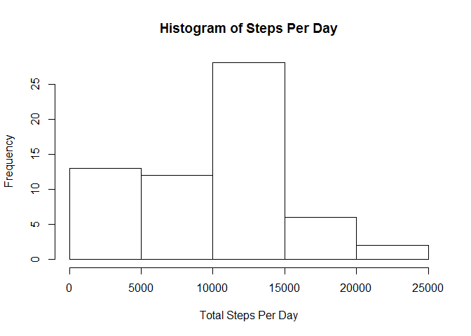
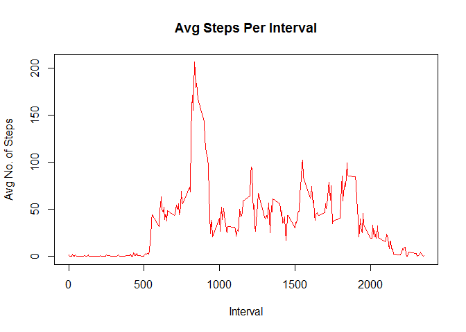
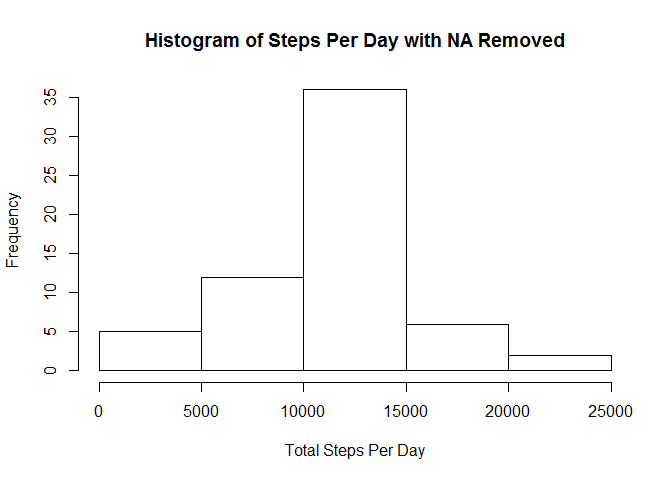
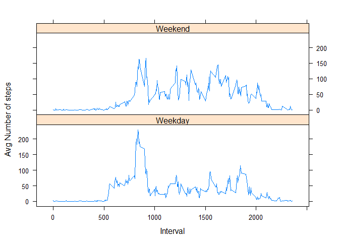

# An Analysis of Activity Data
Dick Cooman  
January 18, 2017  


###Introduction

This document describes the analysis of a simple dataset of activity measured as
steps in each part of a day.  We will expore the data a little, clean it up a bit, and
try to draw a few conclusions.

###Load the Data

First we need to import the data and prepare a dataset for analysis.  The code to do this is listed below:


```r
Dataset_URL <- "https://d396qusza40orc.cloudfront.net/repdata%2Fdata%2Factivity.zip"
download.file(Dataset_URL, "activity.zip")
unzip("activity.zip")
activity <- read.csv("activity.csv",stringsAsFactors=FALSE)
# convert char to date
activity$date <- as.Date(activity$date)
```

Now we have dataset with basic data.  The first few rows are shown below:


```r
head(activity)
```

```
##   steps       date interval
## 1    NA 2012-10-01        0
## 2    NA 2012-10-01        5
## 3    NA 2012-10-01       10
## 4    NA 2012-10-01       15
## 5    NA 2012-10-01       20
## 6    NA 2012-10-01       25
```
###Start the Analysis

The first step in the analysis is to calculate the total number of steps each day
ignoring missing values.  Then we will plot a hisotgram of the data and calculate the mean and median.


```r
StepsPerDay <- aggregate(activity$steps, by=list(Date=activity$date), FUN=sum, na.rm=TRUE)
names(StepsPerDay)=c("Date","Steps")
hist(StepsPerDay$Steps,main="Histogram of Steps Per Day",xlab="Total Steps Per Day")
```

<!-- -->

```r
mean(StepsPerDay$Steps)
```

```
## [1] 9354.23
```

```r
median(StepsPerDay$Steps)
```

```
## [1] 10395
```

As you can see the mean of the data is 9354.2295082 and the median 
is 10395.  From the hisogram it is evident that during the majority of days, the number of steps was between 10,000 and 15,000.

###The Daily Activity Pattern

Now let's look at the daily pattern by graphing the average number of steps taken in each
of the 5-minute intervals over the period.

To do this, we will create a dataset with the average steps per interval and then graph it.  The 
code to do this is below:


```r
StepsPerInterval <- aggregate(activity$steps, by=list(Interval=activity$interval), FUN=mean, na.rm=TRUE)
names(StepsPerInterval) <- c("Interval","AvgSteps")
plot(StepsPerInterval$Interval, StepsPerInterval$AvgSteps,type="l", 
     main="Avg Steps Per Interval", col="red",
     xlab="Interval", ylab="Avg No. of Steps")
```

<!-- -->

Now the question is, What is the interval with the maximum number of steps?  To figure this out, we
will execute the R code below:

```r
MaxSteps <- max(StepsPerInterval$AvgSteps)
Sub1 <- subset(StepsPerInterval, AvgSteps==MaxSteps)
MaxInterval <- Sub1$Interval
MaxInterval
```

```
## [1] 835
```
So we can see that the interval with the highest average steps is 835

###What about missing values?

Missing values can be a problem for a complete data analysis.  Let's see if we have any missing values in our data set.  The code below gets the number of missing values.

```r
NumMissing <- sum(is.na(activity$steps))
NumMissing
```

```
## [1] 2304
```
So there are 2304 rows with missing values.

One of the ways to handle missing values is to set them to an average value that is appropriate.  In this dataset, we could use the daily average or the interval average.  In order to pick which one to use, let's look at where the missing values are located.  We will create a dataset of the missing values by date and see which dates have missing values.  The code below create another data set with the count of the number of missing values for each date.

```r
MissingByDate <- aggregate(is.na(activity$steps),by=list(Date=activity$date), FUN=sum)
names(MissingByDate) = c("Date","NumMissing")
MissingDates <- subset(MissingByDate,NumMissing>0)
MissingDates
```

```
##          Date NumMissing
## 1  2012-10-01        288
## 8  2012-10-08        288
## 32 2012-11-01        288
## 35 2012-11-04        288
## 40 2012-11-09        288
## 41 2012-11-10        288
## 45 2012-11-14        288
## 61 2012-11-30        288
```
From this we can see that the missing values are all located in just eight of the days.  Since 
there are 288 periods in each day, the entire day is missing for these dates.  I guess we can't
use the daily average to replace missing values, so we will have to use the average across
the interval for all dates.  The code below creates yet another data set with the missing
values replaced.  Please note that this code was borrowed from Hadley Wickham himself as he answered a question on this topic for another student of R on r.789695.n4.nabble.com.  My thanks to Mr Wickham.

```r
library(plyr)
impute <- function(x,fun) {
  missing <- is.na(x)
  replace(x,missing,fun(x[!missing]))
} 
activity2 <- ddply(activity, ~ interval, transform, steps = impute(steps,mean))
```

Let's look at the first few rows of October 1st in the new data set to see that the missing values for this date have been replaced with the interval average.

```r
activity2b <- subset(activity2,date=="2012-10-01")
head(activity2b)
```

```
##         steps       date interval
## 1   1.7169811 2012-10-01        0
## 62  0.3396226 2012-10-01        5
## 123 0.1320755 2012-10-01       10
## 184 0.1509434 2012-10-01       15
## 245 0.0754717 2012-10-01       20
## 306 2.0943396 2012-10-01       25
```

Now let's look at a histogram of the new data set with the missing values replaced.


```r
StepsPerDay2 <- aggregate(activity2$steps, by=list(Date=activity2$date), FUN=sum, na.rm=TRUE)
names(StepsPerDay2)=c("Date","Steps")
hist(StepsPerDay2$Steps,main="Histogram of Steps Per Day with NA Removed",
     xlab="Total Steps Per Day")
```

<!-- -->

```r
mean(StepsPerDay2$Steps)
```

```
## [1] 10766.19
```

```r
median(StepsPerDay2$Steps)
```

```
## [1] 10766.19
```
We can see that the mean of the data has changed from 9354.2295082 and the median 
has changed from 10395 to their current values.  So replacing missing values certainly has an effect on the analsis.

###Activity Patterns between Weekdays and Weekends

In order to see if there is any difference between weekdays and weekends, we have to add
another column to our activity2 data set to tell us if the date falls on a weekend or not.  The
code to do this is shown below:

```r
weekdays1 <- c('Monday', 'Tuesday', 'Wednesday', 'Thursday', 'Friday')
activity2$wDay <- c('Weekend', 'Weekday')[(weekdays(activity2$date) %in% weekdays1)+1L]
```
Here are the first 10 rows of activity2 to show the new column.

```r
head(activity2,10)
```

```
##        steps       date interval    wDay
## 1   1.716981 2012-10-01        0 Weekday
## 2   0.000000 2012-10-02        0 Weekday
## 3   0.000000 2012-10-03        0 Weekday
## 4  47.000000 2012-10-04        0 Weekday
## 5   0.000000 2012-10-05        0 Weekday
## 6   0.000000 2012-10-06        0 Weekend
## 7   0.000000 2012-10-07        0 Weekend
## 8   1.716981 2012-10-08        0 Weekday
## 9   0.000000 2012-10-09        0 Weekday
## 10 34.000000 2012-10-10        0 Weekday
```
Now we will create a panel plot to show the activity by interval separated by weekdays and 
weekends.  To do this, we create one final data set with the average number of steps for
each interval for each day type.  The first few rows are shown below:


```r
finalset <- aggregate(activity2$steps, by=list(activity2$interval,activity2$wDay), FUN=mean)
names(finalset)<- c("Interval","DayType","AvgSteps")
head(finalset,10)
```

```
##    Interval DayType   AvgSteps
## 1         0 Weekday 2.25115304
## 2         5 Weekday 0.44528302
## 3        10 Weekday 0.17316562
## 4        15 Weekday 0.19790356
## 5        20 Weekday 0.09895178
## 6        25 Weekday 1.59035639
## 7        30 Weekday 0.69266247
## 8        35 Weekday 1.13794549
## 9        40 Weekday 0.00000000
## 10       45 Weekday 1.79622642
```
Now we will plot the panel plot using lattice graphics and xyplot.


```r
library(lattice)
xyplot(AvgSteps ~ Interval| factor(DayType), 
       data = finalset,
       type = "l",
       xlab = "Interval",
       ylab = "Avg Number of steps",
       layout=c(1,2))
```

<!-- -->

I hope you enjoyed reading this analysis.
